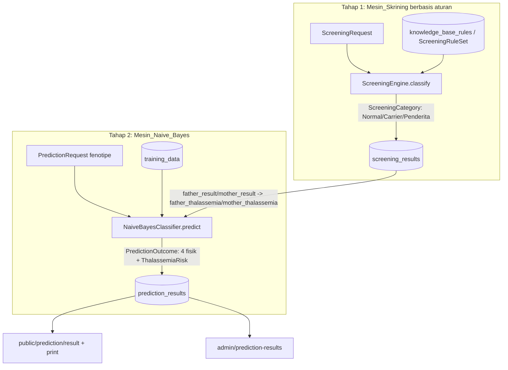

# Design Document

## Overview

Fitur **report-alignment** menyelaraskan terminologi sistem GENETIKAKU yang berjalan dengan terminologi laporan tugas akhir (skripsi), **tanpa mengubah metode klasifikasi (tetap Naive Bayes)** dan **tanpa mengubah kelima Kategori_Keluaran**. Perubahan inti bersifat *terminological refactor* plus *data migration*, bukan perubahan algoritma.

Empat kesenjangan yang ditutup:

1. **Risiko_Thalassemia_Bayi**: `Rendah` / `Sedang` / `Tinggi` → `Minor` / `Intermedia` / `Mayor` (Istilah_Laporan klinis).
2. **Hasil_Skrining_Orang_Tua**: `Berisiko Tinggi` → `Penderita` (kategori `Normal` dan `Carrier` tetap).
3. **Dokumentasi edukatif**: menjelaskan secara eksplisit peran Hukum Mendel sebagai landasan teori penyusunan Data_Latih (bukan mesin pemetaan gen) dan alur dua tahap (Mesin_Skrining → Mesin_Naive_Bayes).
4. **Konsistensi pipeline**: enum domain, validasi, impor CSV, seeder/factory, antarmuka publik/admin, dan data tersimpan harus seragam memakai Istilah_Laporan.

Karena nilai istilah disimpan sebagai *string* pada kolom DB dan direpresentasikan oleh dua *backed enum* (`App\Domain\ThalassemiaRisk`, `App\Domain\ScreeningCategory`), titik perubahan terpusat pada kedua enum tersebut, lalu merembet ke seluruh konsumen yang mereferensikan nama case enum atau nilai literal lama.

### Temuan kunci dari codebase (memengaruhi desain)

- `ThalassemiaRisk` adalah backed enum dengan case `Rendah`/`Sedang`/`Tinggi` (nama case = nilai). Mengubah **nilai** wajib disertai keputusan untuk mengubah **nama case** juga, karena banyak konsumen mereferensikan `ThalassemiaRisk::Rendah` dsb.
- `ScreeningCategory` punya case `BerisikoTinggi = 'Berisiko Tinggi'`. Hanya case ini yang berubah menjadi `Penderita = 'Penderita'`.
- Nilai disimpan sebagai `string` (bukan kolom `enum` DB) pada `training_data`, `screening_results.{father,mother}_result`, dan `prediction_results.thalassemia_risk`. Model meng-*cast* sebagian kolom ke enum (`PredictionResult.thalassemia_risk`, `ScreeningResult.{father,mother}_result`), sehingga nilai lama yang tersimpan akan gagal di-*cast* setelah enum berubah — **Migrasi_Data wajib** sebelum data lama dibaca.
- Literal lama tersebar di: `ScreeningRuleSet::RULES` (`classification_mapping` = `'Berisiko Tinggi'`), `ScreeningEngine::normalizeCategory()` (match `'berisiko tinggi'`), `TrainingDataSeeder` (`'Berisiko Tinggi'`, `'Rendah'`/`'Sedang'`/`'Tinggi'`), `TrainingDataImportController::template()` (baris contoh `'Sedang'`), factory (`TrainingDataFactory`, `PredictionResultFactory`, `ScreeningResultFactory` mereferensikan nama case enum), dan frontend (`result.tsx` switch `'Tinggi'`/`'Sedang'`, `admin/prediction-results/index.tsx` `RISK_BADGE` berkunci `Rendah`/`Sedang`/`Tinggi`).
- Stack pengujian: **Pest 4 + Eris** (`giorgiosironi/eris`) untuk property-based testing, dengan konvensi tag `// Feature: <name>, Property N: <text>` dan default 100 iterasi Eris. Test berjalan di SQLite in-memory.

## Architecture

Alur dua tahap yang ada tidak berubah; hanya nilai istilah yang melintas di antara komponen yang diselaraskan.



Titik integrasi penting (Req 3.4, 3.5): keluaran `ScreeningCategory` Tahap 1 menjadi nilai atribut masukan `father_thalassemia` / `mother_thalassemia` pada Tahap 2. Karena `NaiveBayesClassifier` menerima nilai `ScreeningCategory::cases()` sebagai nilai sah untuk atribut tersebut, penyelarasan `BerisikoTinggi → Penderita` otomatis menjaga konsistensi seam ini tanpa perubahan logika.

### Strategi perubahan (lapisan)

| Lapisan | Berkas | Perubahan |
|---|---|---|
| Enum domain | `ThalassemiaRisk`, `ScreeningCategory` | Ubah nama+nilai case ke Istilah_Laporan |
| Aturan skrining | `ScreeningRuleSet`, `ScreeningEngine` | Literal `'Berisiko Tinggi'` → `'Penderita'`; `normalizeCategory` match `'penderita'` |
| Validasi | `TrainingDataRequest`, `TrainingDataImportController::rowRules()` | Sudah berbasis `*::cases()` → otomatis ikut; verifikasi pesan |
| Impor CSV | `TrainingDataImportController::template()` | Baris contoh memakai Istilah_Laporan |
| Seeder/Factory | `TrainingDataSeeder`, `TrainingDataFactory`, `PredictionResultFactory`, `ScreeningResultFactory` | Literal & referensi nama case |
| Migrasi data | migration baru | Konversi nilai tersimpan lama → Istilah_Laporan |
| Frontend | `result.tsx`, `print.tsx`, `admin/prediction-results/index.tsx`, form admin | Kunci badge/switch & label |
| Edukasi | `PredictionController::educationalContent()` | Tambah penjelasan Hukum Mendel + alur dua tahap |

## Components and Interfaces

### 1. `App\Domain\ThalassemiaRisk` (enum)

Ubah dari tiga case lama menjadi tiga case Istilah_Laporan. Nama case diselaraskan dengan nilainya agar pembacaan kode jelas dan konsisten dengan `ScreeningCategory`.

```php
enum ThalassemiaRisk: string
{
    case Minor = 'Minor';
    case Intermedia = 'Intermedia';
    case Mayor = 'Mayor';
}
```

Konsumen yang mereferensikan `ThalassemiaRisk::Rendah|Sedang|Tinggi` (factory, test) di-*update* ke `Minor|Intermedia|Mayor`. `ThalassemiaRisk::from()` di `NaiveBayesClassifier::compute()` tetap bekerja selama Data_Latih sudah memakai Istilah_Laporan (dijamin oleh validasi + migrasi + seeder).

### 2. `App\Domain\ScreeningCategory` (enum)

```php
enum ScreeningCategory: string
{
    case Normal = 'Normal';
    case Carrier = 'Carrier';
    case Penderita = 'Penderita';
}
```

Hanya case ketiga berubah. Semua referensi `ScreeningCategory::BerisikoTinggi` di-*rename* ke `ScreeningCategory::Penderita`.

### 3. `App\Domain\ScreeningRuleSet`

`classification_mapping` default yang bernilai `'Berisiko Tinggi'` diubah menjadi `'Penderita'` (dua aturan: "Riwayat diagnosis Thalassemia" dan "Riwayat transfusi darah"). Tidak ada perubahan bobot atau struktur aturan.

### 4. `App\Services\ScreeningEngine`

`normalizeCategory()` mencocokkan string mapping ke enum. Tambahkan/ubah cabang match:

```php
return match ($normalized) {
    'normal' => ScreeningCategory::Normal,
    'carrier' => ScreeningCategory::Carrier,
    'penderita' => ScreeningCategory::Penderita,
    default => ScreeningCategory::tryFrom($mapping),
};
```

Logika klasifikasi (indikator kuat → kategori tertinggi, akumulasi bobot Carrier → ambang) tidak berubah. Kategori "tertinggi" kini bernama `Penderita`. Fungsi tetap total dan deterministik (mengembalikan tepat satu `ScreeningCategory`).

### 5. Validasi: `TrainingDataRequest` & `TrainingDataImportController`

Keduanya sudah membangun aturan `Rule::in(...)` dari `ScreeningCategory::cases()` dan `ThalassemiaRisk::cases()`. Setelah enum diubah, validasi otomatis hanya menerima Istilah_Laporan dan menolak istilah lama. Yang perlu disesuaikan:

- `TrainingDataImportController::template()`: baris contoh CSV memakai `Penderita` (bila relevan) dan `Intermedia` alih-alih `'Sedang'`.
- Pesan kesalahan validasi tetap berlaku (Req 4.6, 5.4): impor menolak seluruh berkas bila ada baris tak valid (perilaku "all-or-nothing" yang sudah ada di `store()` dipertahankan).

### 6. Seeder & Factory

- `TrainingDataSeeder`: array `$screening` dan `$severity` memakai `'Penderita'`; `riskFor()` mengembalikan `'Minor'|'Intermedia'|'Mayor'`.
- `TrainingDataFactory`, `ScreeningResultFactory`: referensi `ScreeningCategory::BerisikoTinggi` → `Penderita`.
- `TrainingDataFactory`, `PredictionResultFactory`: referensi `ThalassemiaRisk::Rendah|Sedang|Tinggi` → `Minor|Intermedia|Mayor`.

### 7. Migrasi_Data (migration baru)

Migration `up()` mengonversi nilai tersimpan pada kolom terkait. Bersifat *idempotent* dan aman dijalankan ulang: nilai yang sudah memakai Istilah_Laporan dibiarkan.

```php
// prediction_results.thalassemia_risk
DB::table('prediction_results')->where('thalassemia_risk', 'Rendah')->update(['thalassemia_risk' => 'Minor']);
DB::table('prediction_results')->where('thalassemia_risk', 'Sedang')->update(['thalassemia_risk' => 'Intermedia']);
DB::table('prediction_results')->where('thalassemia_risk', 'Tinggi')->update(['thalassemia_risk' => 'Mayor']);

// screening_results.father_result / mother_result
foreach (['father_result', 'mother_result'] as $col) {
    DB::table('screening_results')->where($col, 'Berisiko Tinggi')->update([$col => 'Penderita']);
}

// training_data.{father,mother}_thalassemia (skrining) + baby_thalassemia_risk (risiko)
foreach (['father_thalassemia', 'mother_thalassemia'] as $col) {
    DB::table('training_data')->where($col, 'Berisiko Tinggi')->update([$col => 'Penderita']);
}
DB::table('training_data')->where('baby_thalassemia_risk', 'Rendah')->update(['baby_thalassemia_risk' => 'Minor']);
DB::table('training_data')->where('baby_thalassemia_risk', 'Sedang')->update(['baby_thalassemia_risk' => 'Intermedia']);
DB::table('training_data')->where('baby_thalassemia_risk', 'Tinggi')->update(['baby_thalassemia_risk' => 'Mayor']);
```

`down()` melakukan konversi terbalik agar migrasi reversibel. Migrasi tidak mengubah nilai yang sudah memakai Istilah_Laporan (Req 8.4), dan setelah dijalankan tidak boleh ada istilah lama tersisa di kolom terkait (Req 8.5).

### 8. Edukasi (`PredictionController::educationalContent()`)

Tambahkan konten yang dikirim ke `result`/`print` untuk memenuhi Req 3.1, 3.2, 3.3, 3.6, 3.7, 3.8. Disarankan menambah kunci eksplisit, mis. `method_explanation` (Naive Bayes atas Data_Latih), `mendel_basis` (Data_Latih mencerminkan pola pewarisan Mendel; Hukum Mendel II sebagai landasan teori variasi fenotipe, **bukan** mesin pemetaan gen/Punnett), dan `two_stage_flow` (Mesin_Skrining berbasis aturan → Mesin_Naive_Bayes). Komponen `result.tsx` sudah punya seksi "Cara Kerja Prediksi (Naive Bayes)"; perluas teks edukatif tanpa mengubah perhitungan.

### 9. Frontend (Inertia/React)

- `public/prediction/result.tsx` → `riskMeta()`: ubah `case 'Tinggi'` → `case 'Mayor'`, `case 'Sedang'` → `case 'Intermedia'`, default tetap menangani `Minor`. Badge risiko menampilkan nilai apa adanya dari prop (`thalassemiaRisk`), sehingga otomatis menampilkan Istilah_Laporan.
- `public/prediction/print.tsx`: menampilkan `thalassemiaRisk` apa adanya — tidak ada kunci khusus untuk diubah; perbarui komentar tipe.
- `admin/prediction-results/index.tsx` → `RISK_BADGE`: ganti kunci `Rendah|Sedang|Tinggi` menjadi `Minor|Intermedia|Mayor` dengan pemetaan warna setara (Minor→hijau, Intermedia→amber, Mayor→merah).
- Form admin Data_Latih (`training-data-form.tsx`) menerima `riskOptions`/`screeningOptions` dari controller (yang berasal dari `*::cases()`), sehingga opsi otomatis menjadi Istilah_Laporan tanpa perubahan komponen.
- Label kelima Kategori_Keluaran (`Golongan Darah`, `Tekstur Rambut`, `Warna Iris Mata`, `Bentuk Cuping Telinga`, `Risiko Thalassemia`) dipertahankan (Req 7.6) — sudah didefinisikan di `VARIABLE_LABELS`.

## Data Models

Tidak ada perubahan **skema** (kolom tetap `string`/`json`). Yang berubah adalah **domain nilai** yang valid pada kolom-kolom berikut.

### Pemetaan_Istilah

| Konteks | Kolom | Nilai lama | Istilah_Laporan |
|---|---|---|---|
| Risiko_Thalassemia_Bayi | `prediction_results.thalassemia_risk`, `training_data.baby_thalassemia_risk` | `Rendah` | `Minor` |
| | | `Sedang` | `Intermedia` |
| | | `Tinggi` | `Mayor` |
| Hasil_Skrining_Orang_Tua | `screening_results.{father,mother}_result`, `training_data.{father,mother}_thalassemia` | `Berisiko Tinggi` | `Penderita` |
| | | `Normal` | `Normal` (tetap) |
| | | `Carrier` | `Carrier` (tetap) |

### Entitas terdampak

- **TrainingData** (`training_data`): `father_thalassemia`, `mother_thalassemia` ∈ {Normal, Carrier, Penderita}; `baby_thalassemia_risk` ∈ {Minor, Intermedia, Mayor}. Kolom fenotipe lain tidak berubah.
- **ScreeningResult** (`screening_results`): `father_result`, `mother_result` di-*cast* ke `ScreeningCategory` ∈ {Normal, Carrier, Penderita}.
- **PredictionResult** (`prediction_results`): `thalassemia_risk` di-*cast* ke `ThalassemiaRisk` ∈ {Minor, Intermedia, Mayor}. `physical_result` dan `probabilities` (JSON) tidak terdampak istilah (kunci `baby_thalassemia_risk` di `probabilities` tetap, tetapi nama kelas di dalamnya mengikuti Istilah_Laporan setelah migrasi/seed baru).

### Invarian pelestarian (Req 9)

- Tepat lima Kategori_Keluaran dipertahankan: 4 fisik (`PhenotypeCategory`) + 1 Risiko_Thalassemia_Bayi.
- `NaiveBayesClassifier` tetap menghasilkan `PredictionOutcome{physical[4], thalassemiaRisk, probabilities}`.
- Data_Latih kosong tetap memicu `EmptyTrainingDataException` (Req 9.3).
- Probabilitas posterior per variabel tetap ditampilkan (Req 9.5).

## Correctness Properties

*A property is a characteristic or behavior that should hold true across all valid executions of a system—essentially, a formal statement about what the system should do. Properties serve as the bridge between human-readable specifications and machine-verifiable correctness guarantees.*

Properti berikut diturunkan dari prework. Beberapa acceptance criteria bersifat definisi enum tetap (1.1, 1.3, 2.1, 2.3), label/opsi UI (7.3–7.6), atau konten edukasi statis (3.2, 3.3) yang lebih tepat diuji sebagai *example/smoke test* (lihat Testing Strategy), bukan properti universal. Kriteria pelestarian (1.5, 3.7, 9.x) dijaga oleh suite property/integration yang sudah ada.

### Property 1: Klasifikasi skrining total, berdomain Istilah_Laporan, dan diterima Mesin_Naive_Bayes

*For any* himpunan jawaban indikator dan *any* Basis_Pengetahuan (kumpulan aturan), `ScreeningEngine::classify` mengembalikan tepat satu `ScreeningCategory` yang nilainya termasuk {`Normal`, `Carrier`, `Penderita`}, dan nilai tersebut diterima oleh `NaiveBayesClassifier` sebagai nilai sah untuk atribut masukan `father_thalassemia`/`mother_thalassemia` (tidak memicu `InvalidAttributeException` karena nilai itu).

**Validates: Requirements 2.5, 3.5**

### Property 2: Risiko_Thalassemia_Bayi round-trip dan berdomain Istilah_Laporan

*For any* `ThalassemiaRisk` beserta hasil fisik dan probabilitas yang valid, menyimpan sebuah `PredictionResult` lalu memuatnya kembali dari penyimpanan mengembalikan `thalassemia_risk` yang identik, dan nilainya selalu salah satu dari {`Minor`, `Intermedia`, `Mayor`} — nilai yang sama inilah yang diteruskan ke Halaman_Hasil dan Halaman_Cetak.

**Validates: Requirements 4.1, 1.4, 7.1, 7.2**

### Property 3: Hasil_Skrining_Orang_Tua round-trip dan berdomain Istilah_Laporan

*For any* Hasil_Skrining (nama ayah, nama ibu, hasil ayah, hasil ibu) dengan hasil dipilih dari `ScreeningCategory`, menyimpan sebuah `ScreeningResult` lalu memuatnya kembali mengembalikan keempat field identik, dan `father_result`/`mother_result` selalu termasuk {`Normal`, `Carrier`, `Penderita`}.

**Validates: Requirements 4.2, 2.4**

### Property 4: Data_Latih round-trip dengan Istilah_Laporan

*For any* baris Data_Latih yang nilai `father_thalassemia`/`mother_thalassemia`-nya termasuk {`Normal`, `Carrier`, `Penderita`} dan `baby_thalassemia_risk`-nya termasuk {`Minor`, `Intermedia`, `Mayor`}, menyimpan lalu memuat ulang baris tersebut mengembalikan nilai kolom-kolom tersebut tanpa perubahan.

**Validates: Requirements 4.3**

### Property 5: Validasi Data_Latih menerima hanya Istilah_Laporan

*For any* nilai kandidat, `TrainingDataRequest` menerima `baby_thalassemia_risk` jika dan hanya jika nilainya termasuk {`Minor`, `Intermedia`, `Mayor`}, dan menerima `father_thalassemia`/`mother_thalassemia` jika dan hanya jika nilainya termasuk {`Normal`, `Carrier`, `Penderita`}; setiap istilah lama (`Rendah`, `Sedang`, `Tinggi`, `Berisiko Tinggi`) maupun string sembarang lain ditolak dengan kesalahan validasi.

**Validates: Requirements 4.4, 4.5, 4.6**

### Property 6: Impor CSV bersifat all-or-nothing terhadap istilah tak valid

*For any* berkas CSV Data_Latih yang memuat setidaknya satu baris dengan nilai risiko atau status skrining di luar Istilah_Laporan, proses impor menolak berkas, melaporkan baris yang tidak valid, dan tidak menyimpan baris apa pun (jumlah `training_data` tidak berubah).

**Validates: Requirements 5.2, 5.3, 5.4**

### Property 7: Factory hanya menghasilkan Istilah_Laporan

*For any* instans yang dihasilkan `PredictionResultFactory` dan `ScreeningResultFactory`, `thalassemia_risk` selalu termasuk {`Minor`, `Intermedia`, `Mayor`} dan `father_result`/`mother_result` selalu termasuk {`Normal`, `Carrier`, `Penderita`}.

**Validates: Requirements 6.3, 6.4**

### Property 8: Migrasi_Data memetakan ke Istilah_Laporan secara lengkap dan idempoten

*For any* kumpulan baris tersimpan yang mencampur istilah lama dan Istilah_Laporan pada kolom terkait, setelah Migrasi_Data dijalankan: (a) setiap nilai lama dikonversi sesuai Pemetaan_Istilah (`Rendah`→`Minor`, `Sedang`→`Intermedia`, `Tinggi`→`Mayor`, `Berisiko Tinggi`→`Penderita`); (b) nilai yang sudah memakai Istilah_Laporan tidak berubah; (c) tidak ada istilah lama tersisa pada kolom terkait; dan (d) menjalankan migrasi dua kali menghasilkan keadaan yang sama dengan sekali (idempoten).

**Validates: Requirements 8.1, 8.2, 8.3, 8.4, 8.5**

## Error Handling

- **Validasi formulir Data_Latih (Req 4.6)**: `TrainingDataRequest` menolak nilai di luar Istilah_Laporan via `Rule::in(...)` yang dibangun dari `*::cases()`, dengan pesan yang sudah ada (`*.in`). Tidak ada perubahan mekanisme; hanya domain nilai yang menyempit otomatis.
- **Impor CSV (Req 5.4)**: perilaku "all-or-nothing" pada `TrainingDataImportController::store()` dipertahankan — bila ada baris tak valid, seluruh impor dibatalkan (`DB::transaction` tidak dijalankan untuk data parsial) dan `rowErrors` (nomor baris + pesan) dikembalikan ke sesi. Batas pelaporan 100 baris error tetap.
- **Data_Latih kosong (Req 9.3)**: `EmptyTrainingDataException` tetap dilempar `NaiveBayesClassifier` dan ditangkap `PredictionController::store()` yang mengembalikan pesan "Prediksi belum dapat dilakukan…". Tidak berubah.
- **Nilai atribut tak terdaftar (Req 3.5)**: `InvalidAttributeException` tetap berlaku. Karena `father_thalassemia`/`mother_thalassemia` menerima `ScreeningCategory::cases()`, penyelarasan ke `Penderita` tidak memperkenalkan kegagalan baru pada seam ini.
- **Cast enum atas data lama**: setelah enum diubah, baris lama yang belum dimigrasi akan menyebabkan `ValueError` saat di-*cast* (`ThalassemiaRisk::from`/`ScreeningCategory::from`). Mitigasi: **Migrasi_Data wajib dijalankan** bersamaan dengan deploy perubahan enum (urutan: migrate → kode enum baru aktif). Migrasi memakai `DB` query builder (bukan model ber-cast) sehingga tidak terpengaruh enum baru.

## Testing Strategy

### Pendekatan

Menggunakan **Pest 4 + Eris** (sudah tersedia di `require-dev`) untuk property-based testing, dilengkapi unit/example test dan integration test. Test berjalan pada SQLite in-memory (lihat `phpunit.xml`).

Setiap property test:
- Menjalankan **minimum 100 iterasi** (default `Eris\TestTrait`).
- Diberi tag komentar dengan format: `// Feature: report-alignment, Property {N}: {teks properti}`.
- Mengimplementasikan **satu** properti desain per test (satu berkas), mengikuti konvensi prefiks simbol unik per berkas yang sudah dipakai suite ini (mis. `prop11ScreeningGenerator`).

### Property tests (baru / diperbarui)

| Properti | Berkas (saran) | Catatan |
|---|---|---|
| P1 | `tests/Unit/Services/ScreeningEngineTest.php` (perbarui) | Generator memakai `ScreeningCategory::Penderita`; assert hasil ∈ cases dan diterima classifier. |
| P2 | `tests/Feature/PredictionResultRoundTripPropertyTest.php` (perbarui) | Generator risiko dari `ThalassemiaRisk::Minor/Intermedia/Mayor`. |
| P3 | `tests/Feature/ScreeningResultRoundTripPropertyTest.php` (perbarui) | Sudah ada (Property 11); cukup ikut perubahan enum. |
| P4 | `tests/Feature/TrainingDataRoundTripPropertyTest.php` (baru) | Round-trip kolom skrining+risiko Data_Latih. |
| P5 | `tests/Feature/TrainingDataRejectsUnregisteredValuesPropertyTest.php` (perbarui) | Tambah penolakan istilah lama untuk risiko/skrining. |
| P6 | `tests/Feature/TrainingDataImportRejectsLegacyTermsPropertyTest.php` (baru) | CSV campuran; assert tidak ada penyimpanan + rowErrors. |
| P7 | `tests/Feature/FactoriesEmitReportTermsPropertyTest.php` (baru) | Banyak instans factory; assert domain nilai. |
| P8 | `tests/Feature/ReportTermMigrationPropertyTest.php` (baru) | Seed mentah via `DB::table()->insert`, jalankan migrasi, assert pemetaan/kelengkapan/idempoten. |

### Example / unit tests

- Enum definisi (Req 1.1, 1.3, 2.1, 2.3): assert `ThalassemiaRisk::cases()` = {Minor, Intermedia, Mayor} dan `ScreeningCategory::cases()` = {Normal, Carrier, Penderita}.
- Templat CSV (Req 5.1): unduh template, assert baris contoh memakai Istilah_Laporan dan tidak mengandung istilah lama.
- Seeder (Req 6.1, 6.2): jalankan `TrainingDataSeeder`, assert semua baris memakai Istilah_Laporan.
- Opsi form admin (Req 7.4, 7.5): assert `riskOptions`/`screeningOptions` dari controller = Istilah_Laporan.
- Label kategori keluaran (Req 7.6): assert label kelima Kategori_Keluaran.

### Frontend checks (Req 7.1, 7.2, 7.3)

- `result.tsx`/`print.tsx` menampilkan nilai risiko apa adanya dari prop → diverifikasi via property/integration di sisi backend (P2) yang memastikan prop bernilai Istilah_Laporan.
- `admin/prediction-results/index.tsx` `RISK_BADGE`: verifikasi kunci mencakup `Minor`/`Intermedia`/`Mayor` (inspeksi komponen). Tidak memerlukan PBT.

### Pelestarian (regression)

Suite property/integration yang ada harus tetap lulus setelah penyesuaian nilai (membuktikan Req 1.5, 3.7, 9.1–9.5):
- `NaiveBayesPredictionTotalTest`, `NaiveBayesPosteriorNormalizedTest`, `NaiveBayesPosteriorSelectionTest`, `NaiveBayesLaplaceLikelihoodTest`, `NaiveBayesEmptyTrainingDataTest`, `NaiveBayesUnknownAttributeTest` — perbarui pool konstanta lokal (`NB_RISK`, `NB_*_THAL`) ke Istilah_Laporan.
- `PredictionFlowEndToEndTest` (Req 3.4, 9.4), `PrintViewContainsMandatorySectionsPropertyTest` (Req 7.2), `PredictionFormOptionsMatchPhenotypesPropertyTest`, `PredictionRejectsUnselectedPhenotypePropertyTest` (Req 4.7).
- Catatan: `tests/Support/NaiveBayesTestData.php` mendefinisikan pool bersama dan harus ikut diselaraskan agar tidak ada nilai istilah lama tersisa di pembangkit data uji.
