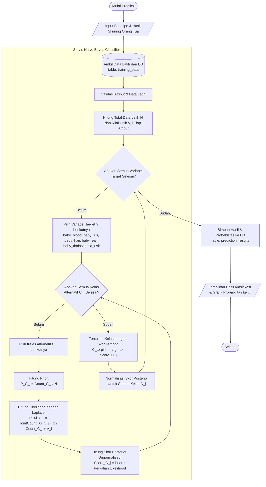

# Dokumentasi Alur dan Perhitungan Naive Bayes (Untuk Bab 4 Implementasi dan Pengujian)

Dokumen ini berisi penjelasan alur metode Naive Bayes, letak berkas/kode di dalam sistem, formula perhitungan yang diimplementasikan (termasuk *Laplace Smoothing*), kode implementasi, serta diagram alur menggunakan Mermaid.

---

## 1. Letak Kode dan Implementasi Metode

Metode Naive Bayes di dalam proyek **Genetikaku** diletakkan secara modular pada struktur berkas berikut:

*   **Logika Perhitungan Klasifikasi**:
    `app/Services/NaiveBayesClassifier.php`
    *   Berkas ini berisi seluruh formula perhitungan Naive Bayes (Prior, Likelihood dengan *Laplace Smoothing*, Posterior, Normalisasi, dan Seleksi Kelas Maksimum).
*   **Pengendali Input & Alur Aliran Data (Controller)**:
    `app/Http/Controllers/Public/PredictionController.php`
    *   Berkas ini mengoordinasikan input fenotipe orang tua, mengambil hasil skrining Thalassemia orang tua dari sesi sebelumnya (*Rule-Based*), memuat Data Latih (*Training Data*), memanggil `NaiveBayesClassifier`, dan menyimpan hasilnya ke database.
*   **Representasi Data Latih & Hasil Klasifikasi**:
    *   `app/Domain/TrainingRow.php` (Struktur baris data latih)
    *   `app/Domain/PredictionOutcome.php` (Struktur objek keluaran prediksi)
*   **Model Database**:
    *   `app/Models/TrainingData.php` (Representasi tabel `training_data`)
    *   `app/Models/PredictionResult.php` (Representasi tabel `prediction_results`)

---

## 2. Alur Prediksi Dua Tahap (Two-Stage Prediction Flow)

Sistem bekerja dalam 2 tahap utama:
1.  **Tahap 1: Skrining Thalassemia Orang Tua (Rule-Based Expert System)**
    *   Sistem menganalisis indikator klinis orang tua (Hb, MCV, MCH, HbA2, HbF, dll.) menggunakan aturan klinis yang ditentukan di sistem pakar (*Rule-Based*) untuk menentukan status Thalassemia masing-masing orang tua (*Normal*, *Carrier*, atau *Penderita*).
2.  **Tahap 2: Prediksi Bayi (Naive Bayes Classifier)**
    *   Sistem menggunakan status Thalassemia orang tua (hasil Tahap 1) bersama dengan data fenotipe fisik mereka (Golongan Darah, Warna Iris Mata, Tekstur Rambut, Bentuk Cuping Telinga) sebagai atribut input ($X$).
    *   Model menghitung probabilitas posterior untuk 5 variabel keluaran ($Y$) bayi secara independen:
        1.  `baby_blood` (Golongan Darah)
        2.  `baby_iris` (Warna Iris Mata)
        3.  `baby_hair` (Tekstur Rambut)
        4.  `baby_ear` (Bentuk Cuping Telinga)
        5.  `baby_thalassemia_risk` (Risiko Thalassemia Bayi)

---

## 3. Rumus Matematika Naive Bayes yang Diimplementasikan

Sistem menghitung nilai probabilitas untuk setiap kelas target menggunakan rumus berikut:

### A. Probabilitas Prior (Prior Probability)
Probabilitas dasar dari suatu kelas $C_j$ tanpa memandang atribut input:

$$P(C_j) = \frac{N_{C_j}}{N}$$

*   $N_{C_j}$: Jumlah data latih yang memiliki kelas $C_j$.
*   $N$: Total seluruh data latih.

### B. Probabilitas Likelihood dengan Laplace Smoothing
Untuk menghindari probabilitas bernilai nol ($0$) ketika suatu kombinasi atribut dan kelas tidak ditemukan di data latih, digunakan *Laplace Smoothing* (penambahan nilai konstanta $1$):

$$P(X_i | C_j) = \frac{N(X_i \cap C_j) + 1}{N_{C_j} + V_i}$$

*   $N(X_i \cap C_j)$: Jumlah data latih dengan kelas $C_j$ yang memiliki nilai atribut $X_i$.
*   $N_{C_j}$: Jumlah data latih yang memiliki kelas $C_j$.
*   $V_i$: Jumlah variasi nilai unik (*distinct values count*) untuk atribut ke-$i$ pada seluruh data latih.

### C. Skor Posterior (Unnormalized Score)
Skor probabilitas untuk kelas $C_j$ setelah mengalikan Prior dengan seluruh Likelihood atribut input:

$$\text{Score}(C_j) = P(C_j) \times \prod_{i=1}^{k} P(X_i | C_j)$$

### D. Seleksi Kelas Terpilih (Maximum A Posteriori - MAP)
Kelas terpilih merupakan kelas dengan nilai posterior tertinggi:

$$C_{\text{terpilih}} = \arg\max_{C_j} \text{Score}(C_j)$$

### E. Normalisasi Probabilitas (Probability Normalization)
Untuk menyajikan tingkat keyakinan (persentase) kepada pengguna, skor posterior dinormalisasi agar total probabilitas seluruh alternatif kelas bernilai $1.0$ ($100\%$):

$$P_{\text{normalized}}(C_j | X) = \frac{\text{Score}(C_j)}{\sum_{m} \text{Score}(C_m)}$$

---

## 4. Diagram Alur Naive Bayes (Mermaid Flowchart)

Berikut adalah diagram alur proses klasifikasi Naive Bayes di sistem yang dapat disalin ke laporan Bab 4:



---

## 5. Implementasi Kode Sumber (PHP Snippet)

Berikut adalah bagian kode kunci dari `app/Services/NaiveBayesClassifier.php` yang menangani proses klasifikasi dan perhitungan formula di atas:

### Fungsi Evaluasi Utama
```php
private function compute(array $input, array $training): PredictionOutcome
{
    $n = count($training);
    $distinctValueCounts = $this->distinctValueCounts($training);
    $outputVariables = array_keys($training[0]->outputClasses());

    $probabilities = [];
    $selected = [];

    foreach ($outputVariables as $variable) {
        // Hitung skor unnormalized (Prior * Likelihood)
        $scores = $this->unnormalizedScores($variable, $input, $training, $n, $distinctValueCounts);
        
        // Cari kelas dengan skor maksimum (MAP)
        $selected[$variable] = $this->classWithMaxScore($scores);
        
        // Normalisasi skor agar bernilai 0.0 - 1.0 (total = 1.0)
        $probabilities[$variable] = $this->normalize($scores);
    }

    $physical = [
        PhenotypeCategory::GolonganDarah->value => $selected['baby_blood'],
        PhenotypeCategory::WarnaIris->value => $selected['baby_iris'],
        PhenotypeCategory::TeksturRambut->value => $selected['baby_hair'],
        PhenotypeCategory::BentukCuping->value => $selected['baby_ear'],
    ];

    $thalassemiaRisk = ThalassemiaRisk::from($selected['baby_thalassemia_risk']);

    return new PredictionOutcome($physical, $thalassemiaRisk, $probabilities);
}
```

### Perhitungan Skor Posterior (Prior & Likelihood dengan Laplace Smoothing)
```php
private function unnormalizedScores(
    string $variable,
    array $input,
    array $training,
    int $n,
    array $distinctValueCounts
): array {
    $classCounts = [];
    foreach ($training as $row) {
        $class = $row->outputClasses()[$variable];
        $classCounts[$class] = ($classCounts[$class] ?? 0) + 1;
    }

    $scores = [];

    foreach ($classCounts as $class => $countOfClass) {
        $class = (string) $class;
        // Prior Probability: P(C_j) = Count(C_j) / N
        $score = $countOfClass / $n;

        foreach ($input as $attribute => $value) {
            $vi = $distinctValueCounts[$attribute] ?? 0;
            // Joint Count: N(X_i ∩ C_j)
            $jointCount = $this->jointCount($training, $variable, (string) $class, (string) $attribute, $value);

            // Likelihood dengan Laplace Smoothing: P(X_i | C_j) = (JointCount + 1) / (Count(C_j) + V_i)
            $score *= ($jointCount + 1) / ($countOfClass + $vi);
        }

        $scores[$class] = $score;
    }

    return $scores;
}
```

---

## 6. Penjelasan Alur Kerja Fungsi

### A. Penjelasan Fungsi `compute`
Fungsi `compute` merupakan fungsi pengendali utama proses klasifikasi Naive Bayes di dalam sistem. Fungsi ini menerima input fenotipe fisik orang tua dan seluruh data latih yang tersedia, kemudian menginisialisasi jumlah total data latih (`$n`) dan jumlah nilai unik (`$distinctValueCounts`) untuk setiap atribut. Fungsi ini melakukan perulangan untuk setiap variabel keluaran bayi secara independen (Golongan Darah, Warna Iris Mata, Tekstur Rambut, Bentuk Cuping Telinga, dan Risiko Thalassemia). Pada setiap iterasi variabel keluaran, fungsi ini memanggil `unnormalizedScores` untuk menghitung skor probabilitas posterior yang belum dinormalisasi untuk semua kemungkinan kelas alternatif, menentukan kelas dengan nilai posterior tertinggi menggunakan `classWithMaxScore` (penerapan aturan *Maximum A Posteriori*), serta menormalisasi skor-skor tersebut menggunakan fungsi `normalize` agar menghasilkan nilai distribusi probabilitas (persentase) yang valid dari 0.0 sampai 1.0. Seluruh hasil akhir kemudian dikemas ke dalam objek `PredictionOutcome` untuk disimpan dan ditampilkan.

### B. Penjelasan Fungsi `unnormalizedScores`
Fungsi `unnormalizedScores` bertugas untuk menghitung skor posterior belum ternormalisasi untuk setiap kelas alternatif pada suatu variabel target berdasarkan metode Naive Bayes. Proses perhitungan diawali dengan menghitung frekuensi kemunculan setiap kelas alternatif (`$classCounts`) di dalam seluruh data latih (`$training`). Selanjutnya, untuk setiap kelas alternatif (`$class`), fungsi ini menghitung nilai probabilitas Prior dengan membagi jumlah kemunculan kelas tersebut dengan total data latih (`$n`). Fungsi kemudian melakukan iterasi terhadap setiap atribut fenotipe orang tua (`$input`). Di dalam perulangan tersebut, fungsi memanggil `jointCount` untuk menghitung frekuensi kemunculan bersama antara kelas terpilih dan nilai atribut input saat ini pada data latih. Probabilitas Likelihood dihitung dengan menerapkan *Laplace Smoothing* (menambahkan konstanta 1 pada pembilang, dan jumlah nilai unik atribut `$vi` pada penyebut) untuk menghindari probabilitas nol jika data tersebut tidak terekam dalam data latih. Terakhir, nilai Prior dikalikan dengan seluruh probabilitas Likelihood atribut input untuk menghasilkan skor posterior akhir yang siap dinormalisasi.
```
