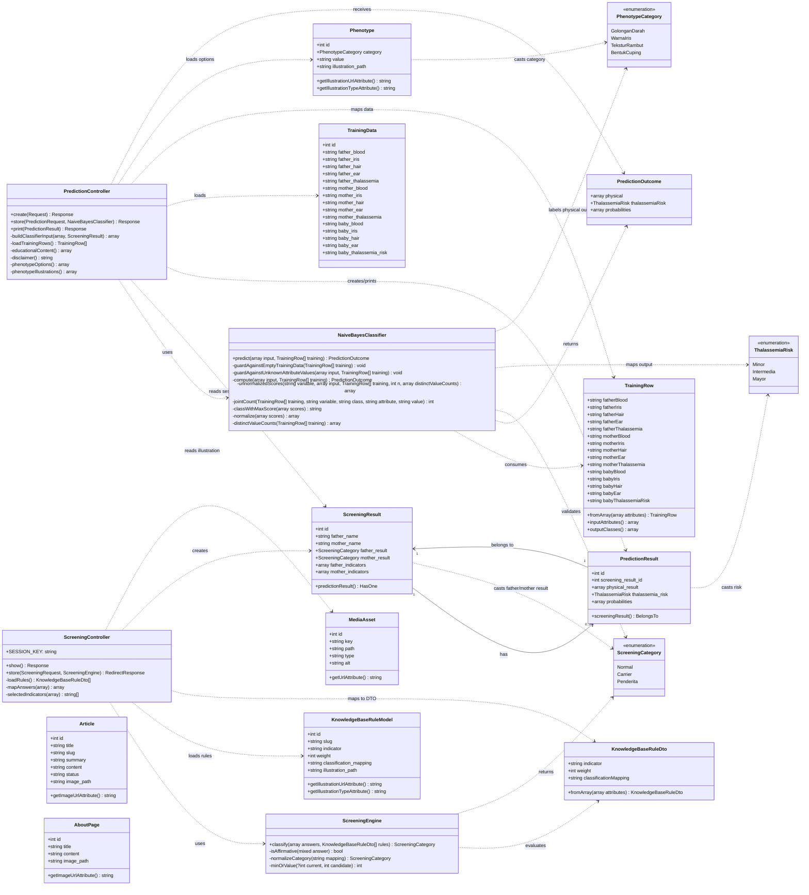

# Class Diagram Genetikaku

Diagram berikut merangkum struktur kelas utama pada aplikasi Genetikaku. Fokus diagram ini adalah modul skrining Thalassemia, prediksi karakteristik bayi dengan Naive Bayes, data latih, basis pengetahuan, dan konten publik.

## Catatan untuk laporan

- `ScreeningController` menangani Tahap 1, yaitu skrining orang tua berdasarkan indikator dan basis pengetahuan.
- `ScreeningEngine` adalah service domain yang mengklasifikasikan hasil skrining menjadi `Normal`, `Carrier`, atau `Penderita`.
- `PredictionController` menangani Tahap 2 dan Tahap 3, yaitu input fenotipe orang tua, pemanggilan mesin Naive Bayes, penyimpanan hasil, dan cetak laporan.
- `NaiveBayesClassifier` menghitung probabilitas posterior dari `TrainingRow[]` dan menghasilkan `PredictionOutcome`.
- `ScreeningResult` berelasi satu-ke-nol/satu dengan `PredictionResult`, karena satu hasil skrining dapat memiliki satu hasil prediksi yang terkait.
- `TrainingData`, `Phenotype`, dan `KnowledgeBaseRuleModel` adalah data master yang dikelola aplikasi untuk prediksi dan skrining.
