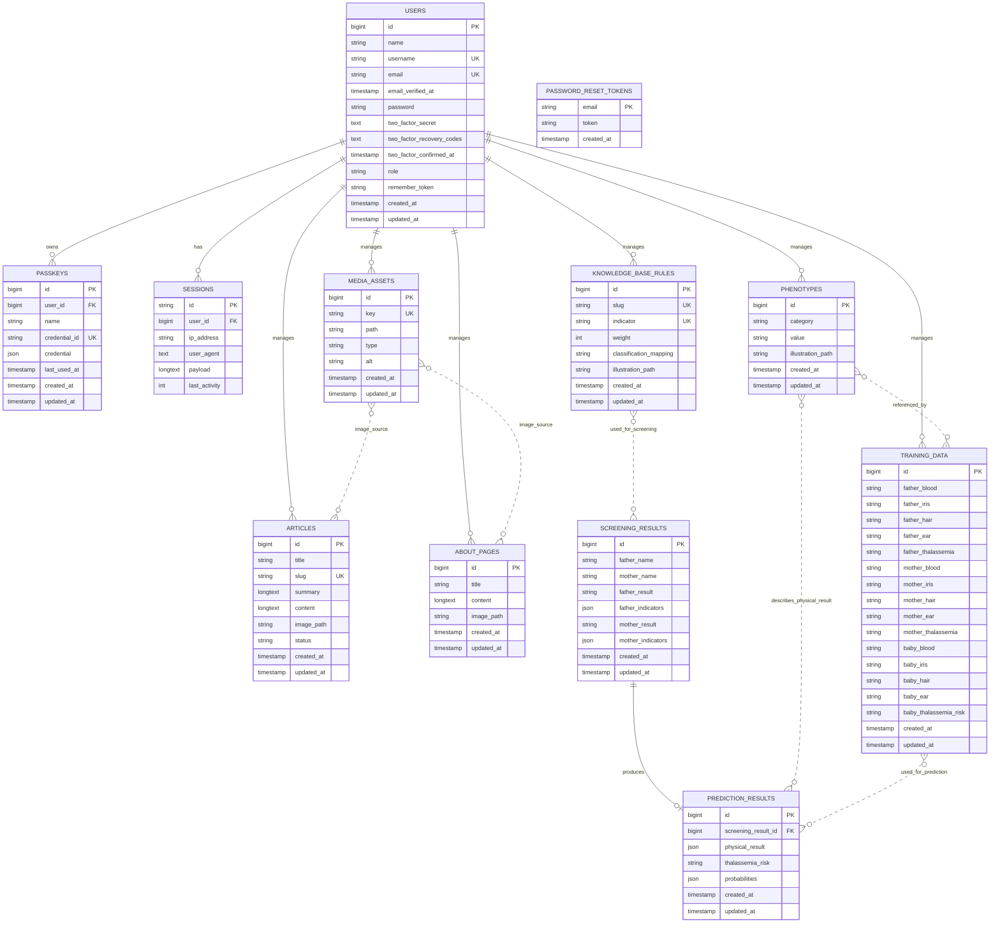

# ERD Genetikaku

Dokumen ini berisi ERD aplikasi Genetikaku untuk digambar ulang di Visual Paradigm. Entitas inti laporan adalah:

- `users`
- `screening_results` / Hasil Skrining
- `prediction_results` / Hasil Prediksi
- `phenotypes` / Fenotipe
- `training_data` / Data Latih
- `knowledge_base_rules` / Basis Pengetahuan
- `articles` / Artikel
- `about_pages` / Tentang
- `media_assets`

Entitas autentikasi pendukung:

- `passkeys`
- `sessions`
- `password_reset_tokens`

## ERD Mermaid

## Relasi Nyata pada Database

Relasi yang benar-benar memiliki foreign key di migration:

| Tabel Asal | FK | Tabel Tujuan | Kardinalitas | Aksi |
|---|---|---|---|---|
| `prediction_results` | `screening_result_id` | `screening_results.id` | `screening_results 1` ke `prediction_results 0..1` | `cascadeOnDelete` |
| `passkeys` | `user_id` | `users.id` | `users 1` ke `passkeys 0..*` | `cascadeOnDelete` |
| `sessions` | `user_id` | `users.id` | `users 1` ke `sessions 0..*` | nullable, index |

## Relasi Konseptual untuk Visual Paradigm

Relasi ini tidak semuanya berupa foreign key fisik, tetapi sesuai alur sistem dan cocok dimasukkan ke ERD konseptual laporan.

| Entitas A | Entitas B | Kardinalitas | Jenis | Keterangan |
|---|---|---|---|---|
| `users` | `passkeys` | `1 : 0..*` | Identifying/strong FK | Satu user dapat memiliki banyak passkey. |
| `users` | `sessions` | `1 : 0..*` | Non-identifying FK | Satu user dapat memiliki banyak session login. |
| `screening_results` | `prediction_results` | `1 : 0..1` | Identifying/strong FK | Satu hasil skrining dapat menghasilkan maksimal satu hasil prediksi terkait. |
| `knowledge_base_rules` | `screening_results` | `0..* : 0..*` | Konseptual | Aturan basis pengetahuan dipakai proses skrining untuk menghasilkan hasil skrining. Tidak ada tabel pivot karena jawaban indikator disimpan sebagai JSON snapshot. |
| `phenotypes` | `training_data` | `0..* : 0..*` | Konseptual | Nilai fenotipe pada data latih mengacu pada daftar nilai di `phenotypes` melalui string kategori/nilai. |
| `phenotypes` | `prediction_results` | `0..* : 0..*` | Konseptual | `physical_result` menyimpan hasil fenotipe bayi dalam JSON. |
| `training_data` | `prediction_results` | `0..* : 0..*` | Konseptual | Data latih digunakan oleh algoritma Naive Bayes untuk menghasilkan prediksi. |
| `media_assets` | `articles` | `0..* : 0..*` | Konseptual | Artikel menyimpan `image_path`; aset media dapat menjadi sumber gambar. |
| `media_assets` | `about_pages` | `0..* : 0..*` | Konseptual | Halaman tentang menyimpan `image_path`; aset media dapat menjadi sumber gambar. |
| `users` | `articles` | `1 : 0..*` | Konseptual | Admin mengelola artikel, tetapi tabel artikel belum menyimpan `user_id`. |
| `users` | `about_pages` | `1 : 0..*` | Konseptual | Admin mengelola halaman tentang, tetapi tabel belum menyimpan `user_id`. |
| `users` | `phenotypes` | `1 : 0..*` | Konseptual | Admin mengelola data fenotipe, tetapi tabel belum menyimpan `user_id`. |
| `users` | `training_data` | `1 : 0..*` | Konseptual | Admin mengelola data latih, tetapi tabel belum menyimpan `user_id`. |
| `users` | `knowledge_base_rules` | `1 : 0..*` | Konseptual | Admin mengelola basis pengetahuan, tetapi tabel belum menyimpan `user_id`. |
| `users` | `media_assets` | `1 : 0..*` | Konseptual | Admin mengelola aset media, tetapi tabel belum menyimpan `user_id`. |

## Detail Entitas untuk Visual Paradigm

### users

Primary key:

- `id`

Unique key:

- `username`
- `email`

Atribut:

- `name`
- `username`
- `email`
- `email_verified_at`
- `password`
- `two_factor_secret`
- `two_factor_recovery_codes`
- `two_factor_confirmed_at`
- `role`
- `remember_token`
- `created_at`
- `updated_at`

### screening_results

Primary key:

- `id`

Atribut:

- `father_name`
- `mother_name`
- `father_result`
- `father_indicators`
- `mother_result`
- `mother_indicators`
- `created_at`
- `updated_at`

Catatan nilai:

- `father_result` dan `mother_result`: `Normal`, `Carrier`, `Penderita`

### prediction_results

Primary key:

- `id`

Foreign key:

- `screening_result_id` ke `screening_results.id`

Atribut:

- `physical_result`
- `thalassemia_risk`
- `probabilities`
- `created_at`
- `updated_at`

Catatan nilai:

- `thalassemia_risk`: `Minor`, `Intermedia`, `Mayor`

### phenotypes

Primary key:

- `id`

Atribut:

- `category`
- `value`
- `illustration_path`
- `created_at`
- `updated_at`

Catatan nilai `category`:

- `Golongan Darah`
- `Warna Iris Mata`
- `Tekstur Rambut`
- `Bentuk Cuping Telinga`

### training_data

Primary key:

- `id`

Atribut input ayah:

- `father_blood`
- `father_iris`
- `father_hair`
- `father_ear`
- `father_thalassemia`

Atribut input ibu:

- `mother_blood`
- `mother_iris`
- `mother_hair`
- `mother_ear`
- `mother_thalassemia`

Atribut output bayi:

- `baby_blood`
- `baby_iris`
- `baby_hair`
- `baby_ear`
- `baby_thalassemia_risk`

Atribut timestamp:

- `created_at`
- `updated_at`

### knowledge_base_rules

Primary key:

- `id`

Unique key:

- `slug`
- `indicator`

Atribut:

- `weight`
- `classification_mapping`
- `illustration_path`
- `created_at`
- `updated_at`

Catatan nilai:

- `classification_mapping`: `Normal`, `Carrier`, `Penderita`

### articles

Primary key:

- `id`

Unique key:

- `slug`

Atribut:

- `title`
- `summary`
- `content`
- `image_path`
- `status`
- `created_at`
- `updated_at`

### about_pages

Primary key:

- `id`

Atribut:

- `title`
- `content`
- `image_path`
- `created_at`
- `updated_at`

### media_assets

Primary key:

- `id`

Unique key:

- `key`

Atribut:

- `path`
- `type`
- `alt`
- `created_at`
- `updated_at`

### passkeys

Primary key:

- `id`

Foreign key:

- `user_id` ke `users.id`

Unique key:

- `credential_id`

Atribut:

- `name`
- `credential`
- `last_used_at`
- `created_at`
- `updated_at`

### sessions

Primary key:

- `id`

Foreign key:

- `user_id` ke `users.id`, nullable

Atribut:

- `ip_address`
- `user_agent`
- `payload`
- `last_activity`

### password_reset_tokens

Primary key:

- `email`

Atribut:

- `token`
- `created_at`

## Saran Gambar di Visual Paradigm

Untuk laporan akademik, gunakan dua lapis ERD:

1. ERD fisik: tampilkan hanya foreign key nyata.
   - `users` ke `passkeys`
   - `users` ke `sessions`
   - `screening_results` ke `prediction_results`

2. ERD konseptual: tambahkan relasi penggunaan data.
   - `knowledge_base_rules` ke `screening_results`
   - `phenotypes` ke `training_data`
   - `training_data` ke `prediction_results`
   - `phenotypes` ke `prediction_results`
   - `users` ke tabel master yang dikelola admin

Jika dosen meminta ERD yang benar-benar mengikuti database, pakai ERD fisik. Jika dosen meminta gambaran sistem secara lengkap, pakai ERD konseptual.
